# 🤖 AI Agents Overview

Sophia v2 features a sophisticated ecosystem of AI agents designed to enhance healthcare delivery through evidence-based decision support, patient engagement, and operational optimization.

## 🏗️ AI Agent Architecture

The platform implements a multi-agent system where each agent specializes in specific aspects of healthcare delivery:

```mermaid
graph TB
    subgraph "AI Agent Ecosystem"
        GENESIS[🧠 Genesis Agent<br/>Care Plan Optimization]
        SOPHIA[💬 Sophia Patient Agent<br/>Patient Engagement]
        COMPLIANCE[🛡️ Compliance Agent<br/>Regulatory Monitoring]
        QUANTUM[📈 Quantum Agent<br/>Analytics & Insights]
        COORD[🔄 Care Coordination<br/>Resource Management]
    end

    subgraph "Data Sources"
        PUBMED[📚 PubMed]
        GUIDELINES[📋 Clinical Guidelines]
        EHR[🏥 EHR Systems]
        OUTCOMES[📊 Outcome Data]
    end

    subgraph "Human Interfaces"
        CLINICIANS[👨‍⚕️ Clinicians]
        PATIENTS[👥 Patients]
        ADMIN[👔 Administrators]
    end

    PUBMED --> GENESIS
    GUIDELINES --> GENESIS
    EHR --> SOPHIA
    OUTCOMES --> QUANTUM

    GENESIS --> CLINICIANS
    SOPHIA --> PATIENTS
    COMPLIANCE --> ADMIN
    QUANTUM --> CLINICIANS
```

## 🧠 Genesis Agent - Evidence-Based Care Optimization

**Route:** `/agents/genesis-agent`

### Purpose

Genesis Agent continuously monitors medical literature and clinical guidelines to suggest evidence-based improvements to care plans, ensuring all protocols remain current with the latest clinical evidence.

### Core Capabilities

#### Literature Monitoring

- **PubMed Integration**: Real-time monitoring of new medical publications
- **Guideline Tracking**: Automated updates from AHA, ACS, NEJM, and other authorities
- **Cochrane Reviews**: Systematic review and meta-analysis integration
- **Quality Assessment**: Automated evidence quality scoring (A, B, C, D levels)

#### Care Plan Analysis

- **Gap Analysis**: Comparison of current plans against latest evidence
- **Outdated Protocol Detection**: Identification of protocols needing updates
- **Recommendation Generation**: Evidence-based improvement suggestions
- **Priority Scoring**: Risk-based prioritization of recommendations

#### Human-in-the-Loop Workflow

### Example Workflow

1. **Literature Ingestion**: Genesis ingests new AHA hypertension guidelines
2. **Plan Analysis**: Detects BP target in "Hypertension Management" plan is outdated
3. **Suggestion Generation**: Suggests update to <130/80 mmHg with full citation
4. **Clinical Review**: Physician reviews evidence package and approves
5. **Implementation**: Plan updated with audit trail documentation

### Interface Features

- **Current Plans Overview**: Active care plans with status and last update dates
- **Suggested Updates**: Pending recommendations with evidence citations
- **Learning Feed**: Real-time medical literature updates
- **Audit Log**: Complete history of suggestions, reviews, and implementations

## 💬 Sophia Patient Engagement Agent

**Route:** `/agents/patient-engagement`

### Purpose

Sophia provides 24/7 patient support through conversational AI, delivering personalized education, monitoring symptoms, and facilitating communication with care teams.

### Core Capabilities

#### Conversational Support

- **Natural Language Processing**: Understanding patient concerns and questions
- **24/7 Availability**: Round-the-clock patient support
- **Emotional Intelligence**: Empathetic responses and anxiety management
- **Multilingual Support**: Communication in multiple languages

#### Personalized Education

- **Procedure-Specific Guidance**: Tailored pre/post-operative instructions
- **Risk Factor Education**: Personalized health education based on patient profile
- **Medication Instructions**: Detailed medication guidance and reminders
- **Recovery Tracking**: Progress monitoring and milestone celebration

#### Symptom Monitoring

- **Proactive Check-ins**: Scheduled patient wellness assessments
- **Symptom Assessment**: Intelligent evaluation of reported symptoms
- **Escalation Protocols**: Automatic alerts for concerning symptoms
- **Trend Analysis**: Pattern recognition in patient-reported data

#### Care Team Integration

- **Communication Hub**: Seamless messaging between patients and providers
- **Alert System**: Priority-based notifications to clinical staff
- **Documentation**: Automatic documentation of patient interactions
- **Handoff Protocols**: Smooth transitions between AI and human support

### Patient Interaction Flow

## 🛡️ Compliance Agent

**Route:** `/agents/compliance-agent`

### Purpose

Ensures continuous compliance with healthcare regulations, quality standards, and institutional policies through automated monitoring and reporting.

### Core Capabilities

#### Regulatory Monitoring

- **HIPAA Compliance**: Automated privacy and security monitoring
- **Joint Commission Standards**: Quality measure compliance tracking
- **CMS Requirements**: Medicare/Medicaid regulation adherence
- **State Regulations**: Local healthcare law compliance

#### Quality Assurance

- **Clinical Indicators**: Automated tracking of quality metrics
- **Outcome Monitoring**: Patient safety and outcome analysis
- **Documentation Review**: Medical record completeness verification
- **Protocol Adherence**: Care plan compliance monitoring

#### Risk Management

- **Compliance Risk Assessment**: Proactive identification of compliance gaps
- **Mitigation Strategies**: Automated recommendation of corrective actions
- **Incident Tracking**: Comprehensive adverse event documentation
- **Trend Analysis**: Pattern recognition in compliance data

#### Automated Reporting

- **Regulatory Reports**: Automated generation of required reports
- **Quality Dashboards**: Real-time compliance status visualization
- **Audit Preparation**: Comprehensive audit trail maintenance
- **Performance Metrics**: Key performance indicator tracking

## 📈 Quantum Analytics Agent

**Route:** `/agents/quantum-agent`

### Purpose

Provides advanced predictive analytics, outcome analysis, and population health insights to optimize clinical decision-making and resource allocation.

### Core Capabilities

#### Predictive Analytics

- **Complication Risk**: Early identification of patients at risk
- **Readmission Prediction**: Machine learning models for readmission risk
- **Length of Stay**: Predictive modeling for resource planning
- **Outcome Forecasting**: Expected clinical outcome predictions

#### Outcome Analysis

- **Surgical Outcomes**: Comprehensive post-operative outcome tracking
- **Treatment Effectiveness**: Comparative effectiveness research
- **Patient Satisfaction**: Outcome correlation with satisfaction scores
- **Cost Analysis**: Treatment cost-effectiveness evaluation

#### Population Health

- **Epidemiological Trends**: Disease pattern analysis across populations
- **Risk Stratification**: Population-level risk assessment
- **Public Health Insights**: Community health trend identification
- **Preventive Care Optimization**: Population-based prevention strategies

#### Research Integration

- **Clinical Evidence**: Automated incorporation of new research findings
- **Best Practice Identification**: Data-driven best practice recommendations
- **Continuous Learning**: Machine learning model improvement
- **Research Hypothesis Generation**: Automated research question formulation

### Analytics Dashboard Features

## 🔄 Care Coordination Agent

### Purpose

Optimizes resource allocation, scheduling, and workflow management across the healthcare delivery system.

### Core Capabilities

#### Intelligent Scheduling

- **Appointment Optimization**: AI-powered scheduling algorithms
- **Resource Allocation**: Operating room and equipment scheduling
- **Staff Coordination**: Provider and nurse schedule optimization
- **Patient Flow**: Efficient patient movement through care pathways

#### Workflow Optimization

- **Process Analysis**: Identification of workflow bottlenecks
- **Efficiency Improvements**: Data-driven process optimization
- **Communication Enhancement**: Streamlined team communication
- **Task Automation**: Automated routine administrative tasks

#### Capacity Planning

- **Demand Forecasting**: Predictive capacity planning
- **Resource Planning**: Equipment and facility utilization optimization
- **Staffing Models**: Data-driven staffing recommendations
- **Emergency Preparedness**: Surge capacity planning

## 🔧 AI Agent Integration

### Technical Architecture

All AI agents are built on a common technical foundation:

- **Microservices Architecture**: Independent, scalable agent services
- **Event-Driven Communication**: Real-time inter-agent communication
- **Shared Data Layer**: Common access to clinical and operational data
- **API-First Design**: RESTful and GraphQL APIs for integration
- **Cloud-Native Deployment**: Kubernetes-based container orchestration

### Security & Privacy

- **Data Encryption**: End-to-end encryption for all agent communications
- **Access Control**: Role-based access control for agent functions
- **Audit Logging**: Comprehensive logging of all agent activities
- **Privacy Protection**: HIPAA-compliant data handling
- **Consent Management**: Patient consent tracking and enforcement

### Quality Assurance

- **Continuous Monitoring**: Real-time agent performance monitoring
- **A/B Testing**: Controlled testing of agent improvements
- **Human Oversight**: Clinical expert review of agent recommendations
- **Feedback Loops**: Continuous learning from clinical outcomes
- **Version Control**: Systematic agent model versioning and rollback

---

This AI agent ecosystem represents a comprehensive approach to healthcare AI, focusing on augmenting human clinical expertise rather than replacing it, ensuring that technology enhances patient care while maintaining the essential human elements of healthcare delivery.
