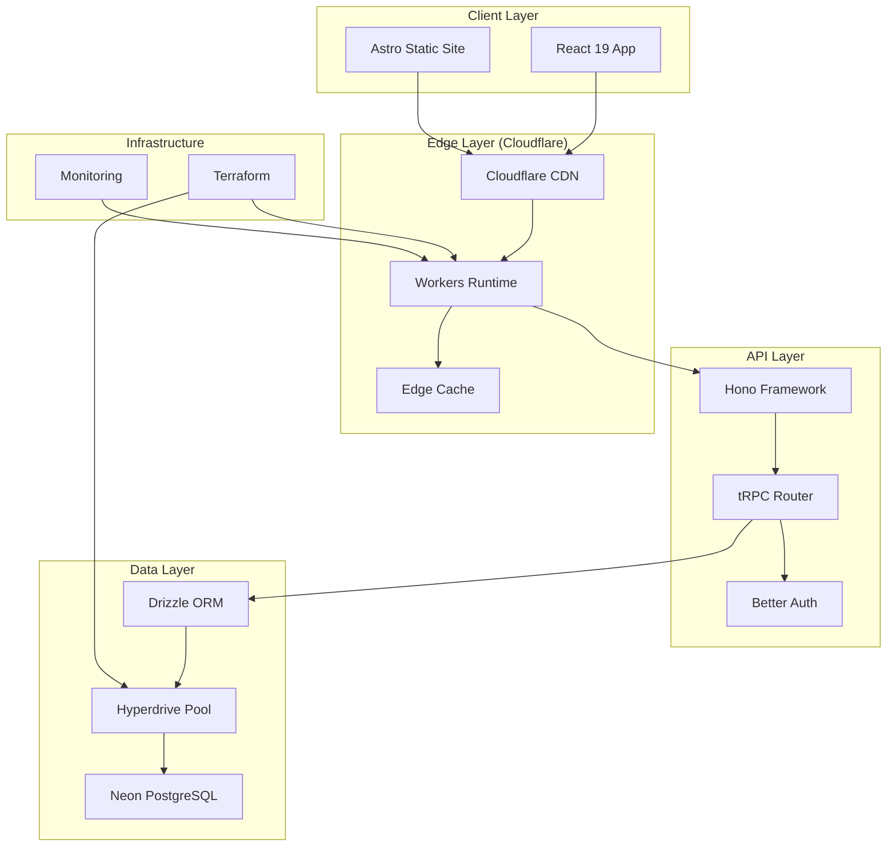
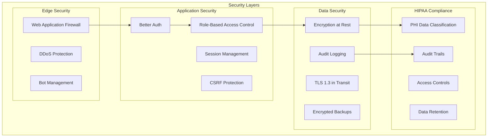
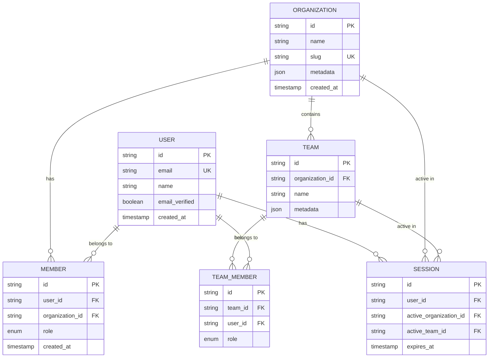

# Sophia v2 - Senior Software Architecture Design

## Executive Summary

This document provides a comprehensive architectural analysis and design recommendations for Sophia v2, a modern React-based healthcare application starter kit. The architecture is designed with scalability, security (HIPAA compliance), maintainability, and AI-assisted development in mind.

## Current Architecture Overview

### Technology Stack Analysis

**Runtime & Platform**
- **Bun**: High-performance JavaScript runtime (3x faster than Node.js)
- **Cloudflare Workers**: Edge computing platform with global distribution
- **Cloudflare Hyperdrive**: Database connection pooling and caching at the edge

**Frontend Architecture**
- **React 19**: Latest concurrent features and server components
- **TanStack Router**: Type-safe routing with data loading
- **Tailwind CSS v4**: Utility-first styling with performance optimizations
- **shadcn/ui**: Accessible component library
- **Jotai**: Atomic state management for fine-grained reactivity
- **Vite**: Next-generation build tooling

**Backend Architecture**
- **Hono**: Ultra-fast web framework optimized for edge computing
- **tRPC**: End-to-end type safety with zero code generation
- **Better Auth**: Modern authentication with OAuth and session management
- **Drizzle ORM**: Type-safe database operations

**Database & Infrastructure**
- **Neon PostgreSQL**: Serverless PostgreSQL with branching
- **Terraform**: Infrastructure as Code for Cloudflare resources

## Architecture Diagrams

### System Architecture Overview



### Security Architecture



### Multi-Tenant Architecture



## 1. Scalability and Bottleneck Analysis

### Current Strengths
✅ **Edge-First Architecture**: Cloudflare Workers provide global distribution
✅ **Connection Pooling**: Hyperdrive eliminates database connection bottlenecks
✅ **Type-Safe APIs**: tRPC prevents runtime errors and improves reliability
✅ **Atomic State Management**: Jotai enables fine-grained updates

### Identified Bottlenecks

#### 1. Database Query Optimization
**Issue**: Potential N+1 queries in multi-tenant scenarios
**Solution**: Implement DataLoader pattern

```typescript
// apps/api/lib/loaders.ts
import DataLoader from 'dataloader';

export const createLoaders = (db: Database) => ({
  usersByOrganization: new DataLoader(async (orgIds: string[]) => {
    const users = await db.query.member.findMany({
      where: inArray(member.organizationId, orgIds),
      with: { user: true }
    });
    return orgIds.map(id => users.filter(u => u.organizationId === id));
  }),
  
  organizationsByUser: new DataLoader(async (userIds: string[]) => {
    const memberships = await db.query.member.findMany({
      where: inArray(member.userId, userIds),
      with: { organization: true }
    });
    return userIds.map(id => memberships.filter(m => m.userId === id));
  })
});
```

#### 2. Frontend Bundle Optimization
**Issue**: Large initial bundle size
**Solution**: Implement route-based code splitting

```typescript
// apps/app/routes/__root.tsx
import { lazy } from 'react';

const DashboardRoute = lazy(() => import('./dashboard'));
const SettingsRoute = lazy(() => import('./settings'));

export const Route = createRootRoute({
  component: () => (
    <Suspense fallback={<LoadingSpinner />}>
      <Outlet />
    </Suspense>
  )
});
```

#### 3. Database Scaling Strategy
**Current**: Single Neon PostgreSQL instance
**Recommendation**: Implement read replicas and connection pooling

```typescript
// db/config.ts
export const dbConfig = {
  primary: {
    connectionString: env.DATABASE_URL,
    maxConnections: 20
  },
  replica: {
    connectionString: env.DATABASE_REPLICA_URL,
    maxConnections: 50
  }
};

// Route read queries to replicas
export const getReadOnlyDb = () => drizzle(replica);
export const getWriteDb = () => drizzle(primary);
```

### Performance Monitoring

```typescript
// apps/api/lib/monitoring.ts
export const performanceMiddleware = async (c: Context, next: Next) => {
  const start = Date.now();
  const path = c.req.path;
  
  await next();
  
  const duration = Date.now() - start;
  
  // Log slow queries
  if (duration > 1000) {
    console.warn(`Slow request: ${path} took ${duration}ms`);
  }
  
  // Send metrics to monitoring service
  c.env.ANALYTICS?.writeDataPoint({
    blobs: [path, c.req.method],
    doubles: [duration],
    indexes: [path]
  });
};
```

## 2. Security and Threat Model

### HIPAA Compliance Framework

#### Administrative Safeguards
```typescript
// apps/api/lib/hipaa.ts
export const hipaaMiddleware = {
  // Access control and user management
  accessControl: async (c: Context, next: Next) => {
    const session = c.get('session');
    const requiredRole = c.req.header('X-Required-Role');
    
    if (!session || !hasRole(session.user, requiredRole)) {
      return c.json({ error: 'Insufficient privileges' }, 403);
    }
    
    // Log access attempt
    await auditLog({
      userId: session.user.id,
      action: 'ACCESS_ATTEMPT',
      resource: c.req.path,
      timestamp: new Date(),
      ipAddress: c.req.header('CF-Connecting-IP')
    });
    
    await next();
  },
  
  // Data minimization
  dataMinimization: (data: any, userRole: string) => {
    const allowedFields = ROLE_FIELD_MAPPING[userRole];
    return pick(data, allowedFields);
  }
};
```

#### Physical Safeguards
- **Cloudflare**: SOC 2 Type II certified data centers
- **Neon**: AWS infrastructure with physical security controls
- **Encryption**: AES-256 encryption at rest, TLS 1.3 in transit

#### Technical Safeguards

```typescript
// apps/api/lib/security.ts
export const securityHeaders = {
  'Strict-Transport-Security': 'max-age=31536000; includeSubDomains',
  'X-Content-Type-Options': 'nosniff',
  'X-Frame-Options': 'DENY',
  'X-XSS-Protection': '1; mode=block',
  'Content-Security-Policy': `
    default-src 'self';
    script-src 'self' 'unsafe-inline' https://apis.google.com;
    style-src 'self' 'unsafe-inline';
    img-src 'self' data: https:;
    connect-src 'self' https://api.openai.com;
  `.replace(/\s+/g, ' ').trim()
};

// Rate limiting
export const rateLimiter = {
  windowMs: 15 * 60 * 1000, // 15 minutes
  max: 100, // limit each IP to 100 requests per windowMs
  message: 'Too many requests from this IP'
};
```

### Threat Model

#### 1. Data Breach Prevention
```typescript
// db/schema/audit.ts
export const auditLog = pgTable('audit_log', {
  id: text('id').primaryKey().$defaultFn(() => uuidv7()),
  userId: text('user_id').references(() => user.id),
  action: text('action').notNull(),
  resource: text('resource'),
  oldValues: json('old_values'),
  newValues: json('new_values'),
  ipAddress: text('ip_address'),
  userAgent: text('user_agent'),
  timestamp: timestamp('timestamp').defaultNow().notNull()
});
```

#### 2. Session Security
```typescript
// apps/api/lib/session.ts
export const sessionConfig = {
  maxAge: 24 * 60 * 60, // 24 hours
  secure: true,
  httpOnly: true,
  sameSite: 'strict' as const,
  
  // Rotate session tokens
  rotateToken: async (sessionId: string) => {
    const newToken = generateSecureToken();
    await db.update(session)
      .set({ token: newToken, updatedAt: new Date() })
      .where(eq(session.id, sessionId));
    return newToken;
  }
};
```

#### 3. Input Validation
```typescript
// apps/api/lib/validation.ts
import { z } from 'zod';

export const sanitizeInput = {
  // Prevent XSS
  sanitizeHtml: (input: string) => {
    return input.replace(/<script[^>]*>.*?<\/script>/gi, '')
                .replace(/<[^>]*>/g, '');
  },
  
  // Prevent SQL injection (handled by Drizzle ORM)
  validateId: z.string().uuid(),
  
  // Rate limiting by user
  userRateLimit: new Map<string, { count: number; resetTime: number }>()
};
```

## 3. Maintainability and Organization

### Code Organization Strategy

#### 1. Domain-Driven Design
```
apps/api/domains/
├── auth/
│   ├── auth.service.ts
│   ├── auth.router.ts
│   └── auth.types.ts
├── organization/
│   ├── organization.service.ts
│   ├── organization.router.ts
│   └── organization.types.ts
└── healthcare/
    ├── patient.service.ts
    ├── patient.router.ts
    └── patient.types.ts
```

#### 2. Shared Utilities
```typescript
// packages/core/src/utils/
export const createService = <T>(config: ServiceConfig<T>) => {
  return {
    async create(data: CreateInput<T>) {
      // Validation
      const validated = config.schema.parse(data);
      
      // Business logic
      const result = await config.repository.create(validated);
      
      // Audit logging
      await auditLog({
        action: 'CREATE',
        resource: config.name,
        data: result
      });
      
      return result;
    },
    
    async update(id: string, data: UpdateInput<T>) {
      // Authorization check
      await config.authorize(id, 'update');
      
      // Update with optimistic locking
      return await config.repository.update(id, data);
    }
  };
};
```

#### 3. Testing Strategy
```typescript
// apps/api/__tests__/integration/
import { createTestContext } from '../helpers/test-context';

describe('Organization API', () => {
  let ctx: TestContext;
  
  beforeEach(async () => {
    ctx = await createTestContext();
  });
  
  afterEach(async () => {
    await ctx.cleanup();
  });
  
  it('should create organization with proper RBAC', async () => {
    const user = await ctx.createUser({ role: 'admin' });
    const org = await ctx.api.organization.create({
      name: 'Test Org',
      slug: 'test-org'
    });
    
    expect(org).toMatchObject({
      name: 'Test Org',
      slug: 'test-org'
    });
    
    // Verify audit log
    const auditEntry = await ctx.db.query.auditLog.findFirst({
      where: eq(auditLog.action, 'CREATE_ORGANIZATION')
    });
    expect(auditEntry).toBeDefined();
  });
});
```

### Documentation Strategy

#### 1. API Documentation
```typescript
// apps/api/lib/openapi.ts
import { generateOpenApiDocument } from 'trpc-openapi';

export const openApiDocument = generateOpenApiDocument(appRouter, {
  title: 'Sophia API',
  version: '2.0.0',
  baseUrl: 'https://api.sophia.dev',
  tags: [
    { name: 'auth', description: 'Authentication endpoints' },
    { name: 'organization', description: 'Organization management' },
    { name: 'healthcare', description: 'Healthcare-specific endpoints' }
  ]
});
```

#### 2. Component Documentation
```typescript
// packages/ui/src/components/Button/Button.stories.tsx
export default {
  title: 'Components/Button',
  component: Button,
  parameters: {
    docs: {
      description: {
        component: 'A versatile button component with multiple variants and sizes.'
      }
    }
  }
} as Meta;

export const Primary: Story = {
  args: {
    variant: 'primary',
    children: 'Click me'
  }
};
```

## 4. Technology Stack for AI-Assisted Development

### AI Integration Points

#### 1. Code Generation
```typescript
// scripts/ai-codegen.ts
import OpenAI from 'openai';

export const generateComponent = async (prompt: string) => {
  const completion = await openai.chat.completions.create({
    model: 'gpt-4',
    messages: [
      {
        role: 'system',
        content: `You are a React component generator. Generate TypeScript React components using:
        - shadcn/ui components
        - Tailwind CSS for styling
        - Proper TypeScript types
        - Accessibility best practices`
      },
      { role: 'user', content: prompt }
    ]
  });
  
  return completion.choices[0].message.content;
};
```

#### 2. Test Generation
```typescript
// scripts/ai-test-gen.ts
export const generateTests = async (componentPath: string) => {
  const componentCode = await fs.readFile(componentPath, 'utf-8');
  
  const testCode = await openai.chat.completions.create({
    model: 'gpt-4',
    messages: [
      {
        role: 'system',
        content: 'Generate comprehensive Vitest tests for React components'
      },
      {
        role: 'user',
        content: `Generate tests for this component:\n${componentCode}`
      }
    ]
  });
  
  return testCode.choices[0].message.content;
};
```

#### 3. Documentation Generation
```typescript
// scripts/ai-docs.ts
export const generateDocs = async (apiSchema: any) => {
  const docs = await openai.chat.completions.create({
    model: 'gpt-4',
    messages: [
      {
        role: 'system',
        content: 'Generate comprehensive API documentation in Markdown format'
      },
      {
        role: 'user',
        content: `Generate docs for this API schema:\n${JSON.stringify(apiSchema, null, 2)}`
      }
    ]
  });
  
  return docs.choices[0].message.content;
};
```

### Development Workflow Integration

```typescript
// .github/workflows/ai-assisted-review.yml
name: AI Code Review
on:
  pull_request:
    types: [opened, synchronize]

jobs:
  ai-review:
    runs-on: ubuntu-latest
    steps:
      - uses: actions/checkout@v4
      - name: AI Code Review
        uses: ./scripts/ai-review-action
        with:
          openai-api-key: ${{ secrets.OPENAI_API_KEY }}
          focus-areas: |
            - Security vulnerabilities
            - HIPAA compliance
            - Performance issues
            - Code quality
```

## 5. Testing Strategy

### Comprehensive Testing Pyramid

#### 1. Unit Tests (70%)
```typescript
// apps/api/__tests__/unit/auth.test.ts
import { describe, it, expect, vi } from 'vitest';
import { authService } from '../lib/auth';

describe('Auth Service', () => {
  it('should hash passwords securely', async () => {
    const password = 'test123';
    const hashed = await authService.hashPassword(password);
    
    expect(hashed).not.toBe(password);
    expect(await authService.verifyPassword(password, hashed)).toBe(true);
  });
  
  it('should validate session tokens', async () => {
    const mockDb = vi.mocked(db);
    mockDb.query.session.findFirst.mockResolvedValue({
      id: 'session-1',
      userId: 'user-1',
      expiresAt: new Date(Date.now() + 86400000)
    });
    
    const session = await authService.validateSession('valid-token');
    expect(session).toBeDefined();
  });
});
```

#### 2. Integration Tests (20%)
```typescript
// apps/api/__tests__/integration/organization.test.ts
import { createTestApp } from '../helpers/test-app';

describe('Organization Integration', () => {
  let app: TestApp;
  
  beforeAll(async () => {
    app = await createTestApp();
  });
  
  it('should handle complete organization workflow', async () => {
    // Create user
    const user = await app.createUser();
    
    // Create organization
    const org = await app.api.organization.create({
      name: 'Test Healthcare Org',
      slug: 'test-healthcare'
    });
    
    // Invite member
    const invitation = await app.api.organization.invite({
      organizationId: org.id,
      email: 'member@test.com',
      role: 'member'
    });
    
    // Accept invitation
    const member = await app.api.organization.acceptInvite({
      token: invitation.token
    });
    
    expect(member.organizationId).toBe(org.id);
  });
});
```

#### 3. End-to-End Tests (10%)
```typescript
// apps/app/__tests__/e2e/auth-flow.spec.ts
import { test, expect } from '@playwright/test';

test('complete authentication flow', async ({ page }) => {
  // Navigate to login
  await page.goto('/login');
  
  // Fill login form
  await page.fill('[data-testid="email"]', 'test@example.com');
  await page.fill('[data-testid="password"]', 'password123');
  await page.click('[data-testid="login-button"]');
  
  // Verify redirect to dashboard
  await expect(page).toHaveURL('/dashboard');
  
  // Verify user menu
  await expect(page.locator('[data-testid="user-menu"]')).toBeVisible();
});
```

### Testing Infrastructure

```typescript
// vitest.workspace.ts
import { defineWorkspace } from 'vitest/config';

export default defineWorkspace([
  {
    test: {
      name: 'unit',
      include: ['**/*.test.ts'],
      environment: 'happy-dom',
      coverage: {
        reporter: ['text', 'json', 'html'],
        threshold: {
          global: {
            branches: 80,
            functions: 80,
            lines: 80,
            statements: 80
          }
        }
      }
    }
  },
  {
    test: {
      name: 'integration',
      include: ['**/*.integration.test.ts'],
      environment: 'node',
      testTimeout: 30000
    }
  }
]);
```

## Implementation Roadmap

### Phase 1: Foundation (Weeks 1-2)
- [ ] Implement comprehensive audit logging
- [ ] Set up HIPAA compliance framework
- [ ] Configure security headers and CSP
- [ ] Implement rate limiting
- [ ] Set up monitoring and alerting

### Phase 2: Scalability (Weeks 3-4)
- [ ] Implement DataLoader pattern
- [ ] Set up database read replicas
- [ ] Implement caching strategy
- [ ] Optimize bundle splitting
- [ ] Performance monitoring

### Phase 3: AI Integration (Weeks 5-6)
- [ ] Set up AI code generation tools
- [ ] Implement automated testing generation
- [ ] Create documentation automation
- [ ] AI-assisted code review

### Phase 4: Advanced Features (Weeks 7-8)
- [ ] Implement advanced RBAC
- [ ] Set up disaster recovery
- [ ] Performance optimization
- [ ] Security penetration testing

## Conclusion

The Sophia v2 architecture provides a solid foundation for building scalable, secure, and maintainable healthcare applications. The recommended improvements focus on:

1. **Enhanced Security**: HIPAA compliance, comprehensive audit logging, and threat mitigation
2. **Improved Scalability**: Database optimization, caching strategies, and performance monitoring
3. **Better Maintainability**: Domain-driven design, comprehensive testing, and documentation
4. **AI Integration**: Automated code generation, testing, and documentation

This architecture positions Sophia v2 as a production-ready platform capable of handling enterprise-scale healthcare applications while maintaining compliance and security standards.