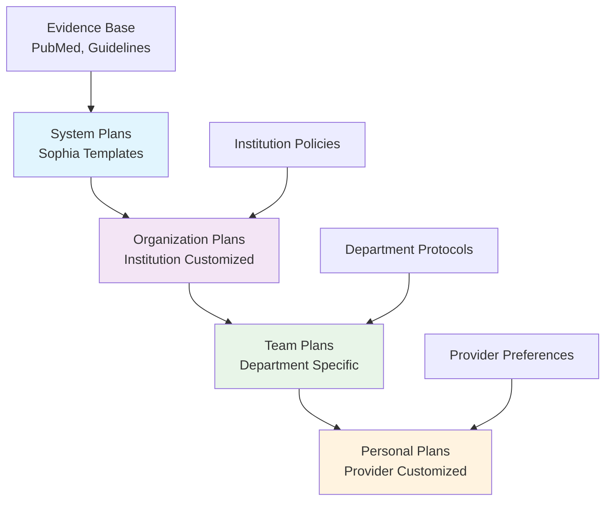
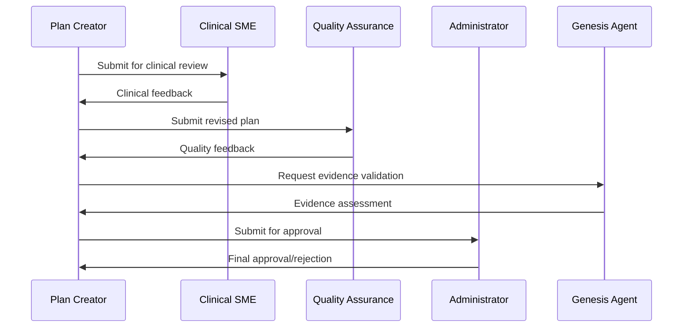

# 📋 Care Plan Management

Comprehensive care plan management system enabling healthcare organizations to create, customize, and manage evidence-based care protocols across multiple organizational levels with AI-powered optimization.

## 🎯 Overview

The Care Plan Management system provides a hierarchical approach to healthcare protocol development, allowing standardized care to be customized at organizational, team, and individual provider levels while maintaining evidence-based foundations.

### Core Principles

- **Evidence-Based Foundation**: All care plans built on current medical evidence
- **Hierarchical Customization**: System → Organization → Team → Personal levels
- **Collaborative Development**: Multi-provider input and review processes
- **Continuous Improvement**: AI-powered optimization and outcome tracking
- **Regulatory Compliance**: Built-in compliance with healthcare standards

## 🏗️ Hierarchical Care Plan Structure



### Plan Hierarchy Levels

#### **1. System Plans** (Sophia Templates)

**Purpose**: Evidence-based foundational templates

- Created by medical experts and Sophia AI team
- Based on latest clinical guidelines and research
- Regularly updated through Genesis Agent monitoring
- Serve as base templates for all derived plans

**Example System Plans:**

- Hypertension Management Protocol
- Post-Operative Cardiac Surgery Care
- Diabetes Type 2 Management
- Pre-Operative Assessment Standard
- Chronic Pain Management

#### **2. Organization Plans** (Institution Level)

**Purpose**: Institutional customizations of system plans

- Adapted to organization-specific policies and resources
- Reflect institutional capabilities and preferences
- Maintain compliance with local regulations
- Include organization-specific quality metrics

**Customization Examples:**

- Preferred medication formularies
- Institution-specific protocols
- Local consultant preferences
- Available diagnostic resources
- Quality improvement initiatives

#### **3. Team Plans** (Department/Specialty Level)

**Purpose**: Department-specific adaptations

- Specialized for clinical departments (Cardiology, Surgery, etc.)
- Incorporate specialty-specific protocols
- Reflect team expertise and resources
- Enable department-specific quality tracking

**Team Adaptations:**

- Specialty-specific assessments
- Department preferred procedures
- Team communication protocols
- Specialized monitoring requirements
- Department-specific education materials

#### **4. Personal Plans** (Individual Provider Level)

**Purpose**: Individual provider customizations

- Reflect personal clinical experience and preferences
- Maintain provider autonomy within evidence-based boundaries
- Enable personalized patient communication
- Support individual quality improvement

**Personal Customizations:**

- Provider-specific patient education approaches
- Individual communication preferences
- Personal clinical decision-making patterns
- Customized follow-up schedules
- Provider-specific quality metrics

## 📊 Care Plan Components

### Core Plan Structure

```typescript
interface CarePlan {
  // Identification
  id: string;
  title: string;
  description: string;
  category: CarePlanCategory;
  planLevel: "system" | "organization" | "team" | "personal";

  // Hierarchy
  derivedFrom?: string; // Parent plan ID
  organizationId?: string;
  teamId?: string;
  ownerId?: string;

  // Content
  content: CarePlanContent;
  phases: CarePlanPhase[];
  validationRules: ValidationRule[];

  // Metadata
  version: string;
  status: "draft" | "active" | "inactive" | "archived";
  createdAt: Date;
  updatedAt: Date;
  lastReviewDate?: Date;
  nextReviewDate?: Date;
}
```

### Plan Content Elements

#### **Clinical Phases**

```typescript
interface CarePlanPhase {
  id: string;
  name: string;
  description: string;
  daysFromStart: number;
  duration: number;
  tasks: ClinicalTask[];
  milestones: Milestone[];
  assessments: Assessment[];
}
```

**Common Clinical Phases:**

- **Pre-admission**: Preparation and assessment
- **Admission**: Initial evaluation and setup
- **Acute Care**: Primary treatment phase
- **Recovery**: Stabilization and improvement
- **Discharge Planning**: Preparation for transition
- **Post-discharge**: Follow-up and monitoring

#### **Clinical Tasks**

```typescript
interface ClinicalTask {
  id: string;
  name: string;
  description: string;
  category: TaskCategory;
  priority: "low" | "medium" | "high" | "critical";

  // Scheduling
  daysFromStart: number;
  estimatedDuration: number;

  // Dependencies
  prerequisites: string[]; // Task IDs

  // Execution
  instructions: string;
  completionCriteria: string[];
  requiredRole: ClinicalRole;

  // Quality
  qualityMetrics: QualityMetric[];
  evidenceLevel: EvidenceLevel;
}
```

**Task Categories:**

- **Assessment**: Patient evaluation and monitoring
- **Intervention**: Therapeutic procedures and treatments
- **Education**: Patient and family education
- **Coordination**: Care team communication and planning
- **Documentation**: Medical record updates and reporting
- **Quality**: Quality assurance and improvement activities

#### **Clinical Assessments**

```typescript
interface Assessment {
  id: string;
  name: string;
  type: AssessmentType;
  frequency: AssessmentFrequency;
  parameters: AssessmentParameter[];
  normalRanges: Range[];
  alertThresholds: AlertThreshold[];
}
```

**Assessment Types:**

- **Vital Signs**: Blood pressure, heart rate, temperature, respiratory rate
- **Pain Assessment**: Pain scales and functional impact
- **Functional Status**: Mobility, activities of daily living
- **Cognitive Assessment**: Mental status and cognitive function
- **Psychosocial**: Mood, anxiety, social support
- **Specialty-Specific**: Disease-specific assessments

## 🔄 Plan Development Workflow

### Creation Process

#### **1. Plan Initiation**

```typescript
// Plan creation workflow
const createCarePlan = async (request: CreateCarePlanRequest) => {
  // Select base template
  const baseTemplate = await selectSystemTemplate(request.condition);

  // Apply organizational customizations
  const orgPlan = await applyOrganizationalCustomizations(
    baseTemplate,
    request.organizationId,
  );

  // Generate plan draft
  const draft = await generatePlanDraft(orgPlan, request.customizations);

  // Submit for review
  return await submitForReview(draft, request.reviewers);
};
```

#### **2. Collaborative Review Process**



#### **3. Review Criteria**

**Clinical Review:**

- Evidence-based content accuracy
- Clinical feasibility and practicality
- Patient safety considerations
- Alignment with specialty standards

**Quality Assurance:**

- Compliance with regulatory requirements
- Integration with existing workflows
- Resource availability and constraints
- Measurable quality metrics

**Administrative Review:**

- Budget and resource implications
- Policy compliance
- Risk management considerations
- Implementation timeline

### Version Control & Change Management

#### **Plan Versioning**

```typescript
interface PlanVersion {
  versionNumber: string; // Semantic versioning (1.0.0)
  changeType: "major" | "minor" | "patch";
  changes: PlanChange[];
  approvedBy: string;
  effectiveDate: Date;
  deprecationDate?: Date;
}

interface PlanChange {
  section: string;
  changeType: "addition" | "modification" | "deletion";
  description: string;
  rationale: string;
  evidenceSource?: string;
}
```

#### **Change Approval Process**

- **Minor Changes**: Department head approval
- **Major Changes**: Medical director and quality committee approval
- **Emergency Changes**: Chief medical officer approval with retrospective review

## 🎯 Plan Customization & Derivation

### Inheritance Model

#### **Modification Types**

```typescript
interface PlanModification {
  id: string;
  parentPlanId: string;
  modificationType: ModificationType;
  section: string;
  originalContent: any;
  modifiedContent: any;
  rationale: string;
  approvedBy: string;
  effectiveDate: Date;
}

enum ModificationType {
  ADD_TASK = "add_task",
  MODIFY_TASK = "modify_task",
  REMOVE_TASK = "remove_task",
  ADJUST_TIMING = "adjust_timing",
  MODIFY_CRITERIA = "modify_criteria",
  ADD_ASSESSMENT = "add_assessment",
  CUSTOMIZE_EDUCATION = "customize_education",
}
```

#### **Derivation Rules**

1. **Additive Changes**: New tasks, assessments, or phases can be added
2. **Modification Constraints**: Core safety elements cannot be removed
3. **Evidence Requirements**: All modifications must include clinical rationale
4. **Approval Hierarchy**: Changes require appropriate level approval
5. **Audit Trail**: Complete history of all modifications maintained

### Example: Hypertension Plan Customization

#### **System Plan** (Base Template)

```yaml
name: "Hypertension Management Protocol"
target_bp: "<140/90 mmHg"
initial_medications:
  - "ACE inhibitor OR ARB"
  - "Thiazide diuretic"
follow_up_schedule:
  - "2 weeks initial"
  - "4 weeks adjustment"
  - "12 weeks maintenance"
```

#### **Organization Plan** (Hospital Customization)

```yaml
name: "Metro Hospital Hypertension Protocol"
inherits_from: "system_hypertension_v2.1"
modifications:
  target_bp: "<130/80 mmHg for high-risk patients"
  preferred_medications:
    - "Lisinopril (formulary preferred)"
    - "Amlodipine (formulary preferred)"
  additional_assessments:
    - "Renal function check at 2 weeks"
  patient_education:
    - "Metro Hospital BP education packet"
```

#### **Team Plan** (Cardiology Department)

```yaml
name: "Cardiology Hypertension Management"
inherits_from: "metro_hospital_hypertension_v1.3"
modifications:
  additional_tasks:
    - "Echocardiogram for all new diagnoses"
    - "24-hour ambulatory BP monitoring"
  specialist_referral_criteria:
    - "Resistant hypertension (>3 medications)"
    - "Secondary hypertension suspected"
  education_materials:
    - "Advanced cardiac risk education"
```

#### **Personal Plan** (Dr. Smith's Customization)

```yaml
name: "Dr. Smith's Hypertension Approach"
inherits_from: "cardiology_hypertension_v1.1"
modifications:
  patient_communication:
    - "Weekly phone check-ins for new patients"
    - "Simplified medication schedule emphasis"
  follow_up_preferences:
    - "1-week initial follow-up for elderly patients"
  quality_tracking:
    - "Personal BP control rate target: 90%"
```

## 📈 Quality Management & Outcomes

### Quality Metrics

#### **Process Metrics**

- **Plan Adherence Rate**: Percentage of tasks completed as prescribed
- **Timeline Compliance**: Adherence to scheduled milestones
- **Documentation Completeness**: Required assessments and notes
- **Resource Utilization**: Efficiency of resource usage

#### **Outcome Metrics**

- **Clinical Outcomes**: Disease-specific improvement measures
- **Patient Satisfaction**: Patient experience and satisfaction scores
- **Length of Stay**: Efficiency of care delivery
- **Readmission Rates**: Post-discharge outcome tracking
- **Complication Rates**: Safety and quality indicators

#### **Cost Metrics**

- **Cost Per Episode**: Total cost of care delivery
- **Resource Efficiency**: Cost-effectiveness ratios
- **Budget Variance**: Actual vs. projected costs
- **Value-Based Metrics**: Outcomes per dollar spent

### Continuous Improvement

#### **Outcome Analysis**

```typescript
interface OutcomeAnalysis {
  planId: string;
  timeframe: DateRange;
  patientCohort: PatientCohort;

  processMetrics: ProcessMetric[];
  outcomeMetrics: OutcomeMetric[];
  qualityIndicators: QualityIndicator[];

  benchmarkComparison: BenchmarkData;
  trendAnalysis: TrendData;
  recommendations: ImprovementRecommendation[];
}
```

#### **AI-Powered Optimization**

Genesis Agent continuously analyzes plan performance and suggests improvements:

1. **Pattern Recognition**: Identifying successful care patterns
2. **Outcome Correlation**: Linking specific interventions to outcomes
3. **Evidence Integration**: Incorporating new research findings
4. **Benchmark Analysis**: Comparing against best-performing plans
5. **Predictive Modeling**: Forecasting plan effectiveness

## 🔧 Technical Implementation

### Database Schema

```sql
-- Core care plan table
CREATE TABLE care_plan (
  id UUID PRIMARY KEY DEFAULT uuid_generate_v7(),
  title VARCHAR(255) NOT NULL,
  description TEXT,
  category VARCHAR(50),
  plan_level VARCHAR(20) NOT NULL,
  derived_from UUID REFERENCES care_plan(id),
  organization_id UUID,
  team_id UUID,
  owner_id UUID,
  content JSONB NOT NULL,
  version_number VARCHAR(20) NOT NULL,
  status VARCHAR(20) DEFAULT 'draft',
  created_at TIMESTAMP DEFAULT NOW(),
  updated_at TIMESTAMP DEFAULT NOW(),
  last_review_date TIMESTAMP,
  next_review_date TIMESTAMP
);

-- Plan modifications tracking
CREATE TABLE care_plan_modification (
  id UUID PRIMARY KEY DEFAULT uuid_generate_v7(),
  parent_plan_id UUID REFERENCES care_plan(id),
  child_plan_id UUID REFERENCES care_plan(id),
  modification_type VARCHAR(50),
  section VARCHAR(100),
  original_content JSONB,
  modified_content JSONB,
  rationale TEXT,
  approved_by UUID REFERENCES user(id),
  effective_date TIMESTAMP DEFAULT NOW()
);

-- Plan usage and outcomes
CREATE TABLE care_plan_usage (
  id UUID PRIMARY KEY DEFAULT uuid_generate_v7(),
  plan_id UUID REFERENCES care_plan(id),
  patient_id UUID,
  start_date TIMESTAMP,
  end_date TIMESTAMP,
  completion_rate DECIMAL(5,2),
  outcome_metrics JSONB,
  quality_scores JSONB,
  created_at TIMESTAMP DEFAULT NOW()
);
```

### API Design

```typescript
// Care Plan Management API
export const carePlanRouter = router({
  // Plan CRUD operations
  list: protectedProcedure
    .input(
      z.object({
        level: z
          .enum(["system", "organization", "team", "personal"])
          .optional(),
        category: z.string().optional(),
        status: z.enum(["draft", "active", "inactive"]).optional(),
      }),
    )
    .query(async ({ input, ctx }) => {
      return await getCarePlans(input, ctx.user);
    }),

  create: protectedProcedure
    .input(createCarePlanSchema)
    .mutation(async ({ input, ctx }) => {
      return await createCarePlan(input, ctx.user);
    }),

  derive: protectedProcedure
    .input(
      z.object({
        parentPlanId: z.string().uuid(),
        modifications: z.array(planModificationSchema),
        level: z.enum(["organization", "team", "personal"]),
      }),
    )
    .mutation(async ({ input, ctx }) => {
      return await derivePlan(input, ctx.user);
    }),

  // Analytics and reporting
  getOutcomes: protectedProcedure
    .input(
      z.object({
        planId: z.string().uuid(),
        timeframe: z.object({
          start: z.date(),
          end: z.date(),
        }),
      }),
    )
    .query(async ({ input, ctx }) => {
      return await getPlanOutcomes(input, ctx.user);
    }),
});
```

## 🚀 Future Enhancements

### Phase 1: Enhanced Collaboration (Q1 2025)

- **Real-time Collaborative Editing**: Multiple providers editing simultaneously
- **Advanced Workflow Management**: Complex approval and review processes
- **Integration APIs**: Third-party EHR and clinical system integration

### Phase 2: AI-Powered Optimization (Q2 2025)

- **Predictive Plan Suggestions**: AI-recommended plan modifications
- **Outcome Prediction**: Forecasting plan effectiveness before implementation
- **Automated Quality Improvement**: AI-driven continuous plan optimization

### Phase 3: Personalized Medicine (Q3 2025)

- **Patient-Specific Plans**: Individual patient factors driving customization
- **Genomic Integration**: Genetic factors influencing care plan selection
- **Social Determinants**: Incorporating social factors into care planning

---

The Care Plan Management system represents a comprehensive approach to healthcare protocol development, enabling organizations to maintain evidence-based care while accommodating the flexibility needed for optimal patient outcomes across diverse clinical settings.
