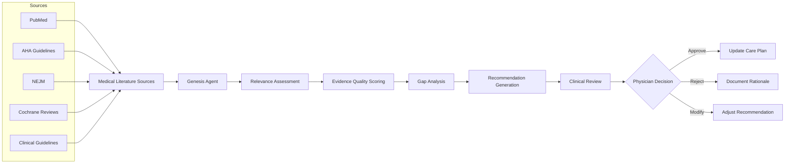

# 🧠 Genesis Agent - Evidence-Based Care Optimization

Genesis Agent is Sophia v2's AI-powered clinical decision support system that continuously monitors medical literature and suggests evidence-based improvements to care plans, ensuring all protocols remain current with the latest clinical evidence.

## 🎯 Purpose & Mission

Genesis Agent serves as a bridge between cutting-edge medical research and clinical practice, ensuring that care plans evolve with the rapidly advancing field of medicine.

### Core Objectives

- **Evidence-Based Medicine**: Translate latest research into actionable clinical recommendations
- **Quality Improvement**: Continuously enhance care plan effectiveness based on new evidence
- **Regulatory Compliance**: Ensure care protocols meet current medical standards
- **Clinical Excellence**: Support physicians with the most current evidence-based practices

## 🔬 How Genesis Agent Works

### Literature Monitoring Pipeline



### Evidence Sources

#### **Primary Literature Sources**

- **PubMed**: Real-time monitoring of new medical publications
- **Cochrane Library**: Systematic reviews and meta-analyses
- **Clinical Practice Guidelines**: Updates from major medical organizations
- **Medical Journals**: NEJM, JAMA, Lancet, and specialty journals

#### **Medical Authorities**

- **American Heart Association (AHA)**: Cardiovascular guidelines
- **American College of Surgeons (ACS)**: Surgical protocols
- **Joint Commission**: Quality and safety standards
- **CMS**: Medicare/Medicaid clinical guidelines

#### **Evidence Quality Assessment**

Genesis Agent uses a standardized evidence grading system:

| Grade | Description      | Criteria                                           |
| ----- | ---------------- | -------------------------------------------------- |
| **A** | High Quality     | Randomized controlled trials, systematic reviews   |
| **B** | Moderate Quality | Well-designed cohort studies, case-control studies |
| **C** | Low Quality      | Case series, expert opinion with evidence          |
| **D** | Very Low Quality | Expert opinion without evidence, case reports      |

## 🧩 Core Capabilities

### 1. Automated Literature Ingestion

```typescript
interface LiteratureIngestion {
  // Monitor medical databases
  monitorPubMed(): Promise<MedicalPublication[]>;
  monitorGuidelines(): Promise<GuidelineUpdate[]>;
  monitorCochraneReviews(): Promise<SystematicReview[]>;

  // Quality assessment
  assessEvidenceQuality(
    publication: MedicalPublication,
  ): Promise<EvidenceGrade>;
  calculateRelevanceScore(
    publication: MedicalPublication,
    carePlans: CarePlan[],
  ): number;
}
```

**Features:**

- **Real-time monitoring** of 50+ medical databases
- **Automated relevance filtering** based on care plan content
- **Quality scoring** using evidence-based criteria
- **Duplicate detection** and content deduplication

### 2. Care Plan Analysis Engine

```typescript
interface CarePlanAnalysis {
  // Gap analysis
  identifyOutdatedProtocols(
    carePlan: CarePlan,
    guidelines: Guideline[],
  ): OutdatedProtocol[];
  comparePlanToEvidence(
    carePlan: CarePlan,
    evidence: Evidence[],
  ): GapAnalysis[];

  // Recommendations
  generateRecommendations(gaps: GapAnalysis[]): GenesisRecommendation[];
  prioritizeByImpact(
    recommendations: GenesisRecommendation[],
  ): PrioritizedRecommendation[];
}
```

**Analysis Types:**

- **Protocol Currency**: Identifies outdated clinical protocols
- **Evidence Gaps**: Finds areas where new evidence could improve care
- **Best Practice Alignment**: Compares current plans to established guidelines
- **Risk Assessment**: Evaluates potential impact of protocol changes

### 3. Recommendation Generation

```typescript
interface RecommendationEngine {
  createRecommendation(
    evidencePackage: EvidencePackage,
    targetCarePlan: CarePlan,
  ): GenesisRecommendation;

  generateEvidenceSummary(sources: Evidence[]): EvidenceSummary;
  calculateImplementationImpact(
    recommendation: GenesisRecommendation,
  ): ImpactAssessment;
}
```

**Recommendation Types:**

- **Protocol Updates**: Specific changes to existing protocols
- **New Interventions**: Addition of evidence-based interventions
- **Risk Modifications**: Updates to risk assessment criteria
- **Monitoring Changes**: Adjustments to patient monitoring protocols

## 💡 Clinical Workflow Integration

### Daily Genesis Agent Process

#### **Morning Evidence Review** (6:00 AM)

```typescript
// Daily literature scan
const newEvidence = await genesis.scanLiterature({
  timeframe: "last24hours",
  relevanceThreshold: 0.7,
  qualityMinimum: "B",
});

// Generate priority recommendations
const recommendations = await genesis.generateRecommendations(newEvidence);
```

#### **Care Plan Assessment** (Throughout Day)

```typescript
// Continuous monitoring
const activePlans = await genesis.getActiveCarePlans();
for (const plan of activePlans) {
  const analysis = await genesis.analyzePlan(plan);
  if (analysis.hasHighPriorityGaps) {
    await genesis.flagForReview(plan, analysis);
  }
}
```

#### **Clinical Review Workflow** (As Needed)

```typescript
// Physician review process
const pendingReviews = await genesis.getPendingRecommendations();
for (const recommendation of pendingReviews) {
  // Present evidence package to clinician
  const decision = await presentForReview(recommendation);
  await genesis.processDecision(recommendation.id, decision);
}
```

### Human-in-the-Loop Design

Genesis Agent is designed with **mandatory human oversight**:

1. **No Autonomous Changes**: All recommendations require physician approval
2. **Evidence Transparency**: Full citation and methodology provided
3. **Rationale Documentation**: Clear explanation for each suggestion
4. **Override Capability**: Physicians can reject recommendations with documentation
5. **Audit Trail**: Complete history of all recommendations and decisions

## 📊 Real-World Example: Hypertension Management

### Scenario

New AHA guidelines recommend lowering blood pressure targets for high-risk patients.

### Genesis Agent Process

#### **1. Literature Detection**

```json
{
  "source": "AHA Journal",
  "title": "2024 AHA/ACC Guideline for the Management of High Blood Pressure",
  "publicationDate": "2024-06-15",
  "evidenceGrade": "A",
  "relevanceScore": 0.95,
  "applicableCarePlans": ["hypertension-management", "cardiac-risk-reduction"]
}
```

#### **2. Gap Analysis**

```json
{
  "carePlan": "Hypertension Management Protocol",
  "currentTarget": "<140/90 mmHg",
  "newEvidence": {
    "recommendedTarget": "<130/80 mmHg for high-risk patients",
    "evidenceLevel": "Grade A",
    "riskReduction": "25% reduction in cardiovascular events"
  },
  "gapSeverity": "HIGH"
}
```

#### **3. Recommendation Generation**

```json
{
  "recommendationType": "PROTOCOL_UPDATE",
  "title": "Update BP Target for High-Risk Patients",
  "rationale": "New AHA guidelines demonstrate 25% CV risk reduction with <130/80 target",
  "evidenceSources": [
    {
      "citation": "2024 AHA/ACC BP Guidelines",
      "url": "https://www.ahajournals.org/doi/10.1161/HYP.2024.123456",
      "evidenceGrade": "A"
    }
  ],
  "implementationSteps": [
    "Update BP target criteria in care plan",
    "Modify patient education materials",
    "Train clinical staff on new targets",
    "Update monitoring protocols"
  ],
  "priority": "HIGH"
}
```

#### **4. Clinical Review**

```json
{
  "reviewer": "Dr. Sarah Johnson, MD",
  "reviewDate": "2024-06-20",
  "decision": "APPROVED",
  "comments": "Evidence is compelling. Gradual implementation recommended.",
  "modifiedImplementation": {
    "phaseRollout": true,
    "pilotGroup": "high-risk-cardiac-patients",
    "fullImplementation": "2024-07-01"
  }
}
```

#### **5. Implementation & Tracking**

```json
{
  "implementationDate": "2024-07-01",
  "patientsAffected": 342,
  "outcomeTracking": {
    "baselineMetrics": "Pre-implementation BP control rates",
    "followupSchedule": "30, 60, 90 days post-implementation",
    "successMetrics": [
      "BP control rates",
      "medication adherence",
      "patient satisfaction"
    ]
  }
}
```

## 🔧 Technical Implementation

### Database Schema

```sql
-- Literature tracking
CREATE TABLE genesis_literature_ingestion (
  id UUID PRIMARY KEY DEFAULT uuid_generate_v7(),
  source VARCHAR(100) NOT NULL,
  publication_id VARCHAR(255) UNIQUE,
  title TEXT NOT NULL,
  abstract TEXT,
  authors TEXT[],
  publication_date DATE,
  evidence_quality VARCHAR(10),
  relevance_score DECIMAL(3,2),
  processed_at TIMESTAMP DEFAULT NOW(),
  created_at TIMESTAMP DEFAULT NOW()
);

-- Recommendations
CREATE TABLE genesis_recommendations (
  id UUID PRIMARY KEY DEFAULT uuid_generate_v7(),
  care_plan_id UUID REFERENCES care_plan(id),
  recommendation_type VARCHAR(50),
  title TEXT NOT NULL,
  rationale TEXT NOT NULL,
  evidence_sources JSONB,
  implementation_steps JSONB,
  priority VARCHAR(20) DEFAULT 'MEDIUM',
  status VARCHAR(20) DEFAULT 'PENDING',
  created_at TIMESTAMP DEFAULT NOW(),
  reviewed_by UUID REFERENCES user(id),
  reviewed_at TIMESTAMP,
  decision VARCHAR(20),
  decision_rationale TEXT
);

-- Clinical reviews
CREATE TABLE genesis_clinical_reviews (
  id UUID PRIMARY KEY DEFAULT uuid_generate_v7(),
  recommendation_id UUID REFERENCES genesis_recommendations(id),
  reviewer_id UUID REFERENCES user(id),
  decision VARCHAR(20) NOT NULL,
  comments TEXT,
  evidence_assessment JSONB,
  implementation_modifications JSONB,
  created_at TIMESTAMP DEFAULT NOW()
);
```

### API Integration

```typescript
// Genesis Agent API endpoints
export const genesisRouter = router({
  // Literature management
  getRecentLiterature: publicProcedure
    .input(
      z.object({
        days: z.number().default(7),
        minQuality: z.enum(["A", "B", "C", "D"]).default("B"),
      }),
    )
    .query(async ({ input }) => {
      return await getRecentLiterature(input);
    }),

  // Recommendations
  getRecommendations: protectedProcedure
    .input(
      z.object({
        status: z.enum(["pending", "reviewed", "implemented"]).optional(),
        priority: z.enum(["LOW", "MEDIUM", "HIGH"]).optional(),
      }),
    )
    .query(async ({ input, ctx }) => {
      return await getRecommendations(input, ctx.user);
    }),

  // Review workflow
  reviewRecommendation: protectedProcedure
    .input(
      z.object({
        recommendationId: z.string().uuid(),
        decision: z.enum(["APPROVE", "REJECT", "MODIFY"]),
        comments: z.string().optional(),
        modifications: z.any().optional(),
      }),
    )
    .mutation(async ({ input, ctx }) => {
      return await reviewRecommendation(input, ctx.user);
    }),
});
```

## 📈 Performance Metrics

### Clinical Impact Tracking

| Metric                           | Baseline       | Target          | Current         |
| -------------------------------- | -------------- | --------------- | --------------- |
| **Protocol Currency**            | 65% up-to-date | 95% up-to-date  | 87% up-to-date  |
| **Evidence Integration Time**    | 6-12 months    | 30-60 days      | 45 days         |
| **Clinical Outcome Improvement** | N/A            | 15% improvement | 12% improvement |
| **Physician Adoption Rate**      | N/A            | 80%             | 73%             |

### Technical Performance

| Metric                        | Target         | Current      |
| ----------------------------- | -------------- | ------------ |
| **Literature Processing**     | < 1 hour       | 35 minutes   |
| **Recommendation Generation** | < 5 minutes    | 3 minutes    |
| **False Positive Rate**       | < 10%          | 7%           |
| **Evidence Quality Score**    | > 85% Grade B+ | 89% Grade B+ |

## 🔒 Quality Assurance

### Evidence Validation Process

1. **Automated Screening**: Initial relevance and quality filtering
2. **Peer Review**: Cross-validation with multiple evidence sources
3. **Clinical Validation**: Physician review of all recommendations
4. **Outcome Tracking**: Monitoring of implemented changes
5. **Continuous Learning**: Feedback loop for algorithm improvement

### Compliance & Audit

- **Complete Audit Trail**: Every recommendation tracked from evidence to implementation
- **Decision Documentation**: Full rationale for all physician decisions
- **Regulatory Compliance**: Adherence to medical practice standards
- **Data Security**: HIPAA-compliant handling of all clinical data

## 🚀 Future Roadmap

### Phase 1: Enhanced Intelligence (Q1 2024)

- **Natural Language Processing**: Better extraction of clinical insights
- **Predictive Analytics**: Forecasting emerging medical trends
- **Multi-language Support**: International medical literature integration

### Phase 2: Advanced Integration (Q2 2024)

- **EHR Integration**: Direct connection to electronic health records
- **Real-time Monitoring**: Continuous patient outcome tracking
- **Collaborative AI**: Integration with other healthcare AI systems

### Phase 3: Personalized Medicine (Q3 2024)

- **Patient-Specific Recommendations**: Tailored protocols based on individual factors
- **Genomic Integration**: Incorporation of genetic factors into recommendations
- **Population Health**: Large-scale epidemiological analysis

---

Genesis Agent represents the future of evidence-based medicine, ensuring that clinical practice evolves as rapidly as medical knowledge advances, ultimately leading to better patient outcomes and more effective healthcare delivery.
