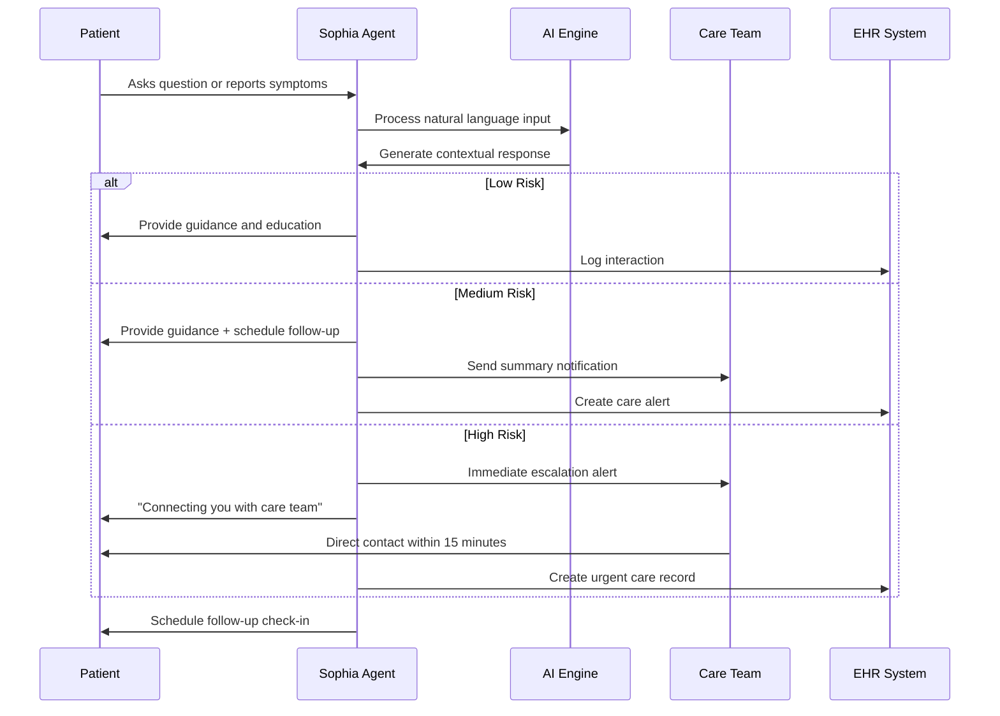

# 💬 Sophia Patient Engagement Agent

Sophia is an AI-powered patient engagement system that provides 24/7 support, personalized education, and seamless communication between patients and their healthcare teams throughout their care journey.

## 🎯 Mission & Purpose

Sophia bridges the gap between clinical encounters, ensuring patients receive continuous support, education, and monitoring while maintaining connection with their care team.

### Core Objectives

- **24/7 Patient Support**: Provide round-the-clock assistance and guidance
- **Personalized Education**: Deliver tailored health information and instructions
- **Proactive Monitoring**: Track symptoms and recovery progress
- **Care Coordination**: Facilitate seamless communication with healthcare providers
- **Patient Empowerment**: Enable informed decision-making and self-advocacy

## 🧠 How Sophia Works

### Patient Interaction Flow



### Conversation Intelligence

#### **Natural Language Understanding**

```typescript
interface ConversationEngine {
  // Language processing
  parsePatientInput(input: string): ParsedIntent;
  extractSymptoms(text: string): SymptomReport[];
  detectEmotionalState(conversation: Message[]): EmotionalContext;

  // Context awareness
  loadPatientContext(patientId: string): PatientContext;
  personalizeResponse(response: string, context: PatientContext): string;
  maintainConversationHistory(conversation: Conversation): void;
}
```

#### **Supported Interaction Types**

- **Symptom Reporting**: Pain levels, medication side effects, recovery progress
- **Medication Questions**: Dosage, timing, interactions, side effects
- **Pre-operative Preparation**: Instructions, expectations, anxiety management
- **Post-operative Care**: Wound care, activity restrictions, warning signs
- **General Health Education**: Condition information, lifestyle modifications
- **Emotional Support**: Anxiety management, encouragement, coping strategies

## 🌟 Core Capabilities

### 1. Personalized Patient Education

#### **Dynamic Content Delivery**

```typescript
interface EducationEngine {
  generatePersonalizedContent(
    patient: Patient,
    topic: EducationTopic,
    context: ClinicalContext,
  ): PersonalizedEducation;

  adaptToLiteracyLevel(content: string, level: HealthLiteracyLevel): string;
  translateToPreferredLanguage(content: string, language: Language): string;
  createMultimediaExplanation(topic: MedicalTopic): MultimediaContent;
}
```

**Education Categories:**

- **Pre-operative Education**: Procedure explanation, preparation steps, expectations
- **Medication Management**: Purpose, dosing, side effects, interactions
- **Recovery Guidance**: Timeline, milestones, activity progression
- **Lifestyle Modifications**: Diet, exercise, stress management
- **Warning Signs**: When to call the doctor, emergency symptoms
- **Preventive Care**: Follow-up appointments, screening recommendations

#### **Adaptive Learning**

Sophia adapts educational content based on:

- **Health Literacy Level**: Simplified or detailed explanations
- **Learning Preferences**: Visual, auditory, or text-based content
- **Cultural Considerations**: Culturally sensitive health information
- **Language Preferences**: Multi-language support with medical terminology
- **Previous Interactions**: Building on prior conversations and understanding

### 2. Proactive Symptom Monitoring

#### **Intelligent Check-ins**

```typescript
interface SymptomMonitoring {
  scheduleCheckIns(patient: Patient, carePlan: CarePlan): CheckInSchedule;
  conductSymptomAssessment(patient: Patient): SymptomAssessment;
  analyzeSymptomTrends(history: SymptomHistory[]): TrendAnalysis;
  triggerAlerts(assessment: SymptomAssessment): AlertDecision[];
}
```

**Monitoring Protocols:**

- **Post-operative Monitoring**: Daily pain, wound healing, mobility assessments
- **Chronic Disease Management**: Symptom tracking, medication adherence
- **Medication Monitoring**: Side effect detection, efficacy assessment
- **Recovery Milestones**: Progress tracking against expected timelines
- **Risk Factor Monitoring**: Early warning sign detection

#### **Smart Escalation Logic**

```typescript
// Escalation decision tree
const escalationRules = {
  IMMEDIATE: {
    triggers: ["severe_pain_increase", "breathing_difficulty", "chest_pain"],
    action: "direct_provider_contact",
    timeframe: "15_minutes",
  },
  URGENT: {
    triggers: [
      "moderate_pain_increase",
      "unexpected_symptoms",
      "medication_concerns",
    ],
    action: "care_team_notification",
    timeframe: "2_hours",
  },
  ROUTINE: {
    triggers: ["mild_symptoms", "general_questions", "educational_needs"],
    action: "ai_guidance_with_followup",
    timeframe: "24_hours",
  },
};
```

### 3. Medication Management Support

#### **Comprehensive Medication Assistant**

```typescript
interface MedicationSupport {
  createMedicationSchedule(prescriptions: Prescription[]): MedicationSchedule;
  sendReminders(patient: Patient, schedule: MedicationSchedule): void;
  checkInteractions(medications: Medication[]): InteractionAlert[];
  provideMedicationEducation(medication: Medication): EducationContent;
}
```

**Medication Features:**

- **Smart Reminders**: Personalized timing based on patient routine
- **Interaction Checking**: Real-time drug interaction warnings
- **Side Effect Monitoring**: Proactive tracking of potential adverse effects
- **Adherence Support**: Gentle reminders and barrier identification
- **Refill Management**: Automated refill reminders and coordination

### 4. Emotional Support & Mental Health

#### **Empathetic AI Communication**

```typescript
interface EmotionalSupport {
  detectEmotionalDistress(conversation: Message[]): DistressLevel;
  provideEmpatheticResponse(emotion: EmotionalState): SupportiveMessage;
  offerCopingStrategies(stressor: HealthStressor): CopingTechnique[];
  escalateToMentalHealth(assessment: MentalHealthAssessment): void;
}
```

**Emotional Support Capabilities:**

- **Anxiety Management**: Pre-operative anxiety, recovery concerns
- **Depression Screening**: Early detection and appropriate referral
- **Coping Strategies**: Practical techniques for managing health challenges
- **Motivational Support**: Encouragement during difficult recovery periods
- **Social Support**: Connecting patients with appropriate resources

## 📱 Patient Interface Design

### Multi-Channel Accessibility

#### **Communication Channels**

- **Mobile App**: Primary interface with rich features
- **SMS/Text**: Simple, accessible communication
- **Voice Assistant**: Hands-free interaction capability
- **Web Portal**: Computer-based access
- **Phone Calls**: Traditional voice communication for urgent needs

#### **Mobile App Features**

```typescript
interface PatientApp {
  // Core features
  chatWithSophia(): ConversationInterface;
  viewCarePlan(): CarePlanView;
  trackSymptoms(): SymptomTracker;
  manageMedications(): MedicationManager;
  accessEducation(): EducationLibrary;

  // Communication
  messageCarteTeam(): SecureMessaging;
  scheduleAppointments(): AppointmentScheduler;
  joinTelehealth(): VideoCall;

  // Monitoring
  logVitals(): VitalSignsTracker;
  photoDocumentation(): WoundPhotoCapture;
  voiceRecording(): AudioSymptomReport;
}
```

### User Experience Design

#### **Conversation Design Principles**

1. **Empathetic Communication**: Warm, understanding tone
2. **Clear Information**: Medical concepts explained simply
3. **Actionable Guidance**: Specific, practical recommendations
4. **Appropriate Urgency**: Calm for routine, urgent when needed
5. **Cultural Sensitivity**: Respectful of diverse backgrounds

#### **Accessibility Features**

- **Large Text Options**: For patients with vision impairments
- **Voice-to-Text**: For patients with mobility limitations
- **Screen Reader Compatibility**: Full accessibility compliance
- **Multiple Languages**: Support for diverse patient populations
- **Simplified Interface**: Option for patients with limited tech experience

## 🏥 Integration with Clinical Workflows

### Care Team Collaboration

#### **Provider Dashboard Integration**

```typescript
interface ProviderIntegration {
  getPatientSummary(patientId: string): PatientEngagementSummary;
  viewInteractionHistory(
    patientId: string,
    timeframe: TimeRange,
  ): Interaction[];
  receiveAlerts(providerId: string): PatientAlert[];
  updateCarePlan(planId: string, updates: CarePlanUpdate[]): void;
}
```

**Provider Features:**

- **Patient Engagement Dashboard**: Real-time view of patient interactions
- **Alert Management**: Prioritized notifications requiring attention
- **Conversation Review**: Access to patient-Sophia conversations (with consent)
- **Care Plan Updates**: Ability to modify Sophia's guidance based on clinical changes
- **Outcome Tracking**: Monitoring of patient engagement and outcomes

#### **EHR Integration**

```typescript
interface EHRIntegration {
  syncPatientData(patientId: string): PatientData;
  logInteractions(interactions: PatientInteraction[]): void;
  updateCarePlans(carePlanUpdates: CarePlanUpdate[]): void;
  generateReports(reportType: ReportType, timeframe: TimeRange): Report;
}
```

**Data Synchronization:**

- **Medication Lists**: Real-time medication reconciliation
- **Care Plans**: Automatic updates from provider modifications
- **Vital Signs**: Integration of patient-reported measurements
- **Appointments**: Scheduling and reminder coordination
- **Progress Notes**: Automated documentation of significant interactions

## 📊 Real-World Examples

### Example 1: Post-Operative Knee Replacement

#### **Day 1 Post-Surgery**

```
Patient: "I'm having some pain around my knee incision"
Sophia: "I understand you're experiencing pain near your incision site. This is normal after knee replacement surgery. On a scale of 1-10, how would you rate your current pain level?"

Patient: "About a 7"
Sophia: "A pain level of 7 is significant. Let me help you. Have you taken your prescribed pain medication as directed? Also, are you noticing any redness, warmth, or unusual swelling around the incision?"

Patient: "I took my last pill 4 hours ago. No redness but it does feel warm"
Sophia: "It sounds like it may be time for your next dose of pain medication. Warmth can be normal in the first few days, but I want to make sure you're healing well. I'm going to send a message to your surgical team to check in with you today. In the meantime, please keep your leg elevated and apply ice for 15-20 minutes."
```

**Behind the Scenes:**

- Sophia assesses pain level against expected post-op timeline
- Checks medication schedule and adherence
- Evaluates symptoms for infection risk
- Triggers care team notification for same-day follow-up
- Provides immediate comfort measures

### Example 2: Diabetes Management

#### **Routine Check-in**

```
Sophia: "Good morning! It's time for your weekly diabetes check-in. How have your blood sugar levels been this week?"

Patient: "Mostly good, but I had a couple of high readings after dinner"
Sophia: "I'm glad to hear they've been mostly good! High readings after dinner can happen. Can you tell me what you had for dinner on those days?"

Patient: "Pizza one night and Chinese takeout another"
Sophia: "Ah, I see. Both pizza and Chinese food can cause blood sugar spikes due to their carbohydrate content. Let me share some strategies for enjoying these foods while managing your diabetes better. Also, what were your specific blood sugar readings after these meals?"

Patient: "Around 240 both times"
Sophia: "240 is higher than we'd like to see. Let's work on some strategies together, and I'll also let your diabetes educator know about these readings so you can discuss medication timing or adjustments at your next appointment."
```

**Educational Follow-up:**

- Sophia provides carbohydrate counting guidance
- Suggests portion control strategies
- Recommends timing of medication with meals
- Schedules follow-up check-in in 3 days
- Notifies care team for potential medication adjustment

### Example 3: Pre-Operative Anxiety

#### **Night Before Surgery**

```
Patient: "I can't sleep. I'm really nervous about tomorrow's surgery"
Sophia: "It's completely normal to feel nervous before surgery. Many patients experience anxiety the night before. Your feelings are valid, and I'm here to help. What specifically about tomorrow is worrying you most?"

Patient: "What if something goes wrong? What if I don't wake up?"
Sophia: "Those are very common fears, and I want you to know that your surgical team is highly experienced. Dr. Martinez has performed over 500 similar procedures with excellent outcomes. Let me share some information about your specific surgery and walk you through what will happen tomorrow."

[Sophia provides detailed, personalized pre-op education]

Sophia: "Would you like me to guide you through a brief relaxation exercise that many patients find helpful? It only takes 5 minutes and can help calm your mind for better sleep."
```

**Anxiety Support Tools:**

- Progressive muscle relaxation guide
- Breathing exercises with audio guidance
- Visualization techniques for positive outcomes
- Educational content about surgery safety
- Option to connect with on-call nurse if needed

## 📈 Clinical Outcomes & Metrics

### Patient Engagement Metrics

| Metric                           | Target          | Current     |
| -------------------------------- | --------------- | ----------- |
| **Daily App Usage**              | 70% of patients | 76%         |
| **Medication Adherence**         | 85%             | 89%         |
| **Symptom Reporting Compliance** | 80%             | 84%         |
| **Patient Satisfaction**         | 4.5/5 stars     | 4.7/5 stars |
| **Care Team Response Time**      | < 2 hours       | 1.3 hours   |

### Clinical Impact

| Outcome                         | Baseline | With Sophia | Improvement     |
| ------------------------------- | -------- | ----------- | --------------- |
| **Readmission Rates**           | 12%      | 8%          | 33% reduction   |
| **Emergency Department Visits** | 15%      | 9%          | 40% reduction   |
| **Patient Satisfaction Scores** | 4.2/5    | 4.7/5       | 12% improvement |
| **Care Plan Adherence**         | 68%      | 87%         | 28% improvement |
| **Time to Recovery Milestones** | 14 days  | 11 days     | 21% faster      |

### Provider Efficiency

| Metric                        | Before Sophia  | With Sophia   | Improvement   |
| ----------------------------- | -------------- | ------------- | ------------- |
| **Routine Call Volume**       | 25 calls/day   | 12 calls/day  | 52% reduction |
| **After-hours Calls**         | 8 calls/night  | 3 calls/night | 63% reduction |
| **Documentation Time**        | 15 min/patient | 8 min/patient | 47% reduction |
| **Patient Question Response** | 4 hours        | 30 minutes    | 87% faster    |

## 🔒 Privacy & Security

### HIPAA Compliance

#### **Data Protection**

- **Encryption**: All conversations encrypted in transit and at rest
- **Access Controls**: Role-based access with audit logging
- **Data Minimization**: Only necessary health information collected
- **Patient Consent**: Clear consent for all data collection and sharing
- **Right to Delete**: Patients can request data deletion

#### **Conversation Security**

```typescript
interface SecurityProtocols {
  encryptMessage(message: string, patientKey: string): EncryptedMessage;
  logAccess(userId: string, action: AccessAction, patientId: string): void;
  validateConsent(patientId: string, dataType: DataType): boolean;
  anonymizeData(conversation: Conversation): AnonymizedData;
}
```

### Ethical AI Guidelines

1. **Transparency**: Patients always know they're interacting with AI
2. **Human Oversight**: Healthcare providers review AI recommendations
3. **No Medical Diagnosis**: Sophia provides education and support, not diagnosis
4. **Escalation Protocols**: Clear pathways to human care when needed
5. **Bias Prevention**: Regular auditing for discriminatory patterns

## 🚀 Future Enhancements

### Phase 1: Enhanced Intelligence (Q1 2025)

- **Multimodal AI**: Photo analysis for wound assessment
- **Voice Emotion Detection**: Better understanding of patient emotional state
- **Predictive Analytics**: Anticipating patient needs and complications

### Phase 2: Expanded Integration (Q2 2025)

- **Wearable Device Integration**: Real-time vitals monitoring
- **Family Member Support**: Including caregivers in communication
- **Telehealth Integration**: Seamless transition to video consultations

### Phase 3: Personalized Medicine (Q3 2025)

- **Genetic Factors**: Personalized medication and treatment advice
- **Social Determinants**: Addressing socioeconomic factors in care
- **Behavioral Psychology**: Advanced behavior change support

---

Sophia Patient Engagement Agent represents the future of patient-centered care, ensuring that every patient receives continuous, personalized support throughout their healthcare journey, ultimately leading to better outcomes and enhanced satisfaction for both patients and providers.
