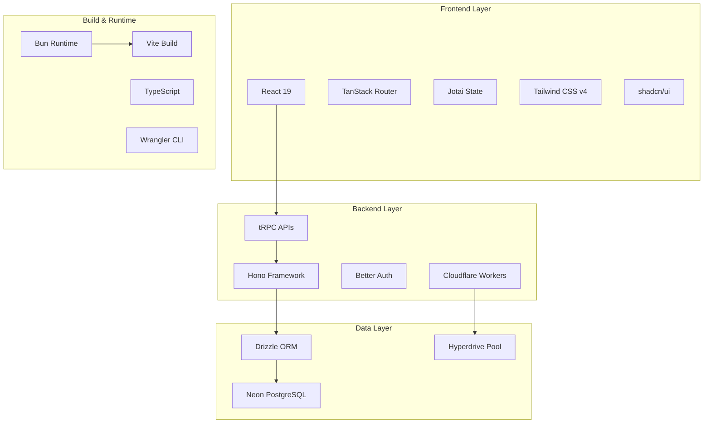

# 🛠️ Technology Stack

Comprehensive overview of the modern technology stack powering Sophia v2 healthcare platform.

## 🏗️ Architecture Overview

Sophia v2 uses a cutting-edge technology stack designed for performance, scalability, and healthcare compliance.



## 🚀 Core Runtime & Platform

### **Bun** v1.2+

**Ultra-fast JavaScript runtime and package manager**

**Why Bun:**

- **3x faster** than Node.js for healthcare data processing
- **Native TypeScript** support without compilation step
- **Built-in bundler** and test runner
- **Single binary** for simplified deployment

**Key Features:**

```bash
# Package management
bun install              # 10x faster than npm install
bun add package         # Add dependencies
bun remove package      # Remove dependencies

# Script execution
bun run script         # Execute package.json scripts
bun test              # Built-in test runner
bun build             # Native bundler
```

### **Cloudflare Workers**

**Edge computing platform for global performance**

**Why Cloudflare Workers:**

- **Global distribution** across 300+ edge locations
- **Sub-100ms response times** for clinical applications
- **Automatic scaling** for variable healthcare workloads
- **V8 isolates** for secure multi-tenant execution

**Edge Benefits:**

- **Healthcare compliance** with data residency
- **High availability** for critical clinical systems
- **Cost efficiency** with pay-per-request model
- **Zero cold starts** for responsive user experience

## ⚛️ Frontend & UI Stack

### **React 19**

**Latest React with concurrent features**

**Healthcare-Optimized Features:**

- **Concurrent rendering** for responsive clinical interfaces
- **Automatic batching** for optimal performance
- **Suspense integration** for loading states
- **Server components** for SEO and performance

```tsx
// Example: Healthcare component with concurrent features
function PatientDashboard() {
  const [isPending, startTransition] = useTransition();

  const handlePatientSelect = (patient) => {
    startTransition(() => {
      // Non-urgent UI updates don't block urgent ones
      setSelectedPatient(patient);
    });
  };

  return (
    <Suspense fallback={<ClinicalSkeleton />}>
      <PatientList onSelect={handlePatientSelect} />
      {isPending && <LoadingIndicator />}
    </Suspense>
  );
}
```

### **TanStack Router**

**Type-safe routing with data loading**

**Clinical Workflow Benefits:**

- **File-based routing** for healthcare workflows
- **Type-safe navigation** prevents broken clinical links
- **Data preloading** for faster patient data access
- **Search parameter validation** for filtering

```typescript
// Example: Type-safe patient route
export const Route = createFileRoute("/patient/$patientId")({
  beforeLoad: requireAuth,
  loader: async ({ params }) => {
    return await fetchPatient(params.patientId);
  },
  validateSearch: z.object({
    tab: z.enum(["overview", "history", "plans"]).optional(),
  }),
  component: PatientDetails,
});
```

### **Jotai**

**Atomic state management**

**Healthcare State Advantages:**

- **Bottom-up state** design for complex clinical data
- **Atomic updates** prevent unnecessary re-renders
- **Derived state** for computed medical metrics
- **Async atoms** for real-time patient data

```typescript
// Example: Healthcare state atoms
export const selectedPatientAtom = atom<Patient | null>(null);
export const patientRiskAtom = atom((get) => {
  const patient = get(selectedPatientAtom);
  return calculateRiskScore(patient);
});
export const criticalPatientsAtom = atom(async () => {
  return await fetchCriticalPatients();
});
```

### **Tailwind CSS v4**

**Utility-first CSS framework**

**Healthcare Design Benefits:**

- **CSS-based configuration** for better performance
- **Healthcare color palette** for clinical environments
- **Responsive design** for various medical devices
- **High contrast support** for accessibility

```css
/* Healthcare-specific theme */
@theme inline {
  --color-medical-primary: oklch(0.5 0.2 220);
  --color-risk-high: oklch(0.6 0.25 0);
  --color-risk-medium: oklch(0.7 0.15 60);
  --color-risk-low: oklch(0.7 0.15 120);
}
```

### **shadcn/ui**

**Accessible component library**

**Clinical UI Components:**

- **Radix UI primitives** for accessibility compliance
- **Copy-paste architecture** for component ownership
- **Healthcare customizations** for medical workflows
- **WCAG 2.1 compliance** for clinical environments

## 🌐 Backend & API Stack

### **Hono**

**Ultra-fast web framework for edge computing**

**Edge-Optimized Features:**

- **Lightweight runtime** perfect for Cloudflare Workers
- **Zero dependencies** for fast cold starts
- **Middleware ecosystem** for healthcare compliance
- **TypeScript-first** design

```typescript
// Example: Healthcare API with Hono
const app = new Hono()
  .use("*", cors())
  .use("/api/*", authenticateUser)
  .use("/api/patient/*", auditMiddleware)
  .route("/api", healthcareRoutes);
```

### **tRPC**

**End-to-end type safety**

**Healthcare API Benefits:**

- **Type-safe procedures** for medical data
- **Real-time subscriptions** for patient monitoring
- **Input validation** with Zod schemas
- **Error handling** for clinical workflows

```typescript
// Example: Type-safe patient API
export const patientRouter = router({
  getById: publicProcedure
    .input(z.object({ id: z.string().uuid() }))
    .query(async ({ input, ctx }) => {
      return await ctx.db.patient.findUnique({
        where: { id: input.id },
      });
    }),

  updateRiskLevel: protectedProcedure
    .input(updatePatientRiskSchema)
    .mutation(async ({ input, ctx }) => {
      // Update with audit trail
      return await updatePatientWithAudit(input, ctx.user);
    }),
});
```

### **Better Auth**

**Modern authentication solution**

**Healthcare Authentication:**

- **Multi-provider support** (Google, Azure AD, etc.)
- **Session management** for clinical shifts
- **Role-based access** for healthcare teams
- **HIPAA-compliant** session handling

```typescript
// Example: Healthcare authentication config
export const authConfig = {
  providers: [
    google({
      clientId: env.GOOGLE_CLIENT_ID,
      clientSecret: env.GOOGLE_CLIENT_SECRET,
    }),
    azureAD({
      tenantId: env.AZURE_TENANT_ID,
      clientId: env.AZURE_CLIENT_ID,
    }),
  ],
  session: {
    duration: 8 * 60 * 60, // 8-hour clinical shifts
    maxAge: 12 * 60 * 60, // 12-hour absolute maximum
  },
};
```

## 🗄️ Database & ORM Stack

### **Neon PostgreSQL**

**Serverless PostgreSQL database**

**Healthcare Database Features:**

- **Branching** for safe schema migrations
- **Serverless scaling** for variable workloads
- **Point-in-time recovery** for data protection
- **Global replication** for multi-region compliance

**Healthcare Extensions:**

```sql
-- Required PostgreSQL extensions
CREATE EXTENSION IF NOT EXISTS "pg_uuidv7";  -- Time-ordered UUIDs
CREATE EXTENSION IF NOT EXISTS "pg_crypto";   -- Encryption functions
CREATE EXTENSION IF NOT EXISTS "pg_audit";    -- Audit logging
```

### **Drizzle ORM**

**TypeScript-first ORM**

**Healthcare Data Benefits:**

- **Type-safe queries** for medical data
- **Schema validation** at compile time
- **Migration generation** from TypeScript schemas
- **Zero runtime overhead**

```typescript
// Example: Healthcare schema with Drizzle
export const patient = pgTable("patient", {
  id: text()
    .primaryKey()
    .$defaultFn(() => uuidv7()),
  patMrnId: text("pat_mrn_id").unique(),
  firstName: text("first_name").notNull(),
  lastName: text("last_name").notNull(),
  birthDate: date("birth_date"),
  riskLevel: riskLevelEnum("risk_level").default("Low"),
  createdAt: timestamp("created_at").defaultNow(),
});

// Type-safe queries
const highRiskPatients = await db
  .select()
  .from(patient)
  .where(eq(patient.riskLevel, "High"));
```

### **Cloudflare Hyperdrive**

**Database connection pooling at the edge**

**Performance Benefits:**

- **Connection pooling** reduces database load
- **Query caching** at edge locations
- **Reduced latency** for global applications
- **Automatic scaling** based on demand

## 🛠️ Development Tools

### **Vite**

**Next-generation build tool**

**Development Benefits:**

- **Instant HMR** for fast development
- **Native ES modules** for faster builds
- **Plugin ecosystem** for healthcare-specific tools
- **Optimized production builds**

### **Vitest**

**Blazing fast test runner**

**Healthcare Testing:**

- **Unit testing** for clinical functions
- **Integration testing** for healthcare workflows
- **Snapshot testing** for UI components
- **Coverage reporting** for compliance

```typescript
// Example: Healthcare unit test
import { calculateRiskScore } from "./risk-assessment";

test("calculates high risk for elderly cardiac patients", () => {
  const patient = {
    age: 75,
    conditions: ["cardiac_disease"],
    medications: ["warfarin"],
  };

  expect(calculateRiskScore(patient)).toBe("High");
});
```

### **TypeScript** v5.9.2

**Static type checking**

**Healthcare Type Safety:**

- **Medical data types** prevent runtime errors
- **API contract enforcement** between systems
- **Configuration validation** for deployment
- **IDE intelligence** for faster development

```typescript
// Example: Healthcare type definitions
export interface Patient {
  readonly id: PatientId;
  readonly patMrnId: MedicalRecordNumber;
  firstName: string;
  lastName: string;
  birthDate: Date;
  riskLevel: RiskLevel;
  conditions: MedicalCondition[];
}

export type RiskLevel = "Low" | "Medium" | "High" | "Critical";
export type PatientId = string & { readonly brand: unique symbol };
```

### **ESLint & Prettier**

**Code quality and formatting**

**Healthcare Code Standards:**

- **Medical data handling** rules
- **HIPAA compliance** checks
- **Accessibility** requirements
- **Security** best practices

## 🌐 Deployment & Infrastructure

### **Wrangler CLI**

**Cloudflare Workers deployment**

```bash
# Development
wrangler dev

# Staging deployment
wrangler deploy --env=staging

# Production deployment
wrangler deploy --env=production

# Secrets management
wrangler secret put HIPAA_ENCRYPTION_KEY --env=production
```

### **Terraform** (Infrastructure as Code)

**Reproducible infrastructure**

```hcl
# Example: Cloudflare infrastructure
resource "cloudflare_worker_script" "healthcare_api" {
  name    = "sophia-v2-api"
  content = file("dist/index.js")

  kv_namespace_binding {
    name         = "CACHE"
    namespace_id = cloudflare_kv_namespace.healthcare_cache.id
  }
}
```

## 🔐 Security & Compliance Stack

### **HIPAA Compliance Tools**

- **Data encryption** with industry-standard algorithms
- **Audit logging** for all data access
- **Access controls** with role-based permissions
- **Data retention** policies and automated cleanup

### **Security Monitoring**

- **Real-time alerts** for security incidents
- **Compliance dashboards** for regulatory reporting
- **Vulnerability scanning** for dependencies
- **Penetration testing** integration

## 🤖 AI & Machine Learning

### **OpenAI Integration**

```typescript
// Example: AI-powered clinical decision support
const aiAnalysis = await openai.chat.completions.create({
  model: "gpt-4",
  messages: [
    {
      role: "system",
      content: "You are a clinical decision support AI...",
    },
    {
      role: "user",
      content: `Analyze this patient case: ${patientData}`,
    },
  ],
});
```

### **Medical APIs**

- **PubMed API** for literature monitoring
- **HL7 FHIR** for healthcare data exchange
- **Clinical guidelines** APIs for evidence-based care
- **Drug interaction** databases for medication safety

## 📊 Performance Characteristics

### **Runtime Performance**

- **Bun**: 3x faster than Node.js
- **Edge deployment**: Sub-100ms global response times
- **Database**: Connection pooling with Hyperdrive
- **Caching**: Multi-layer caching strategy

### **Developer Experience**

- **Hot reload**: Instant feedback during development
- **Type safety**: Catch errors at compile time
- **AI assistance**: Optimized for LLM development
- **Documentation**: Comprehensive guides and examples

### **Healthcare Compliance**

- **HIPAA ready**: Built-in compliance features
- **Audit trails**: Comprehensive logging
- **Data encryption**: End-to-end security
- **Role-based access**: Granular permissions

---

This technology stack provides a solid foundation for building modern, scalable, and compliant healthcare applications while maintaining excellent developer experience and performance characteristics.
